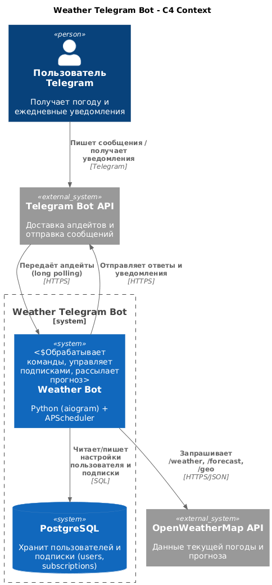
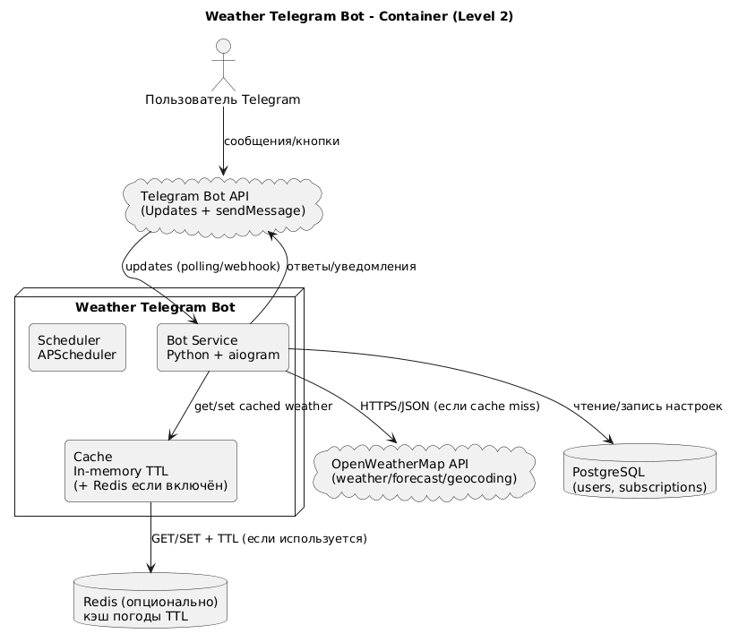
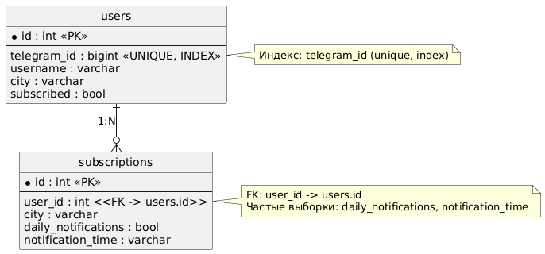

# Weather Telegram Bot

Telegram bot для получения погоды и ежедневных уведомлений. Курсовой проект.

---

## Участники проекта

- **ФИО:** Маришин Леонид Владимирович
- **Группа:** 5130904/30104

# Этапы

Ниже описаны все этапы разработки ПО.

---

## 1) Определение проблемы

Пользователям неудобно регулярно вручную проверять погоду и прогноз, а также помнить про ежедневные уведомления.  
Из-за этого приходится постоянно заходить в погодные сервисы и повторять одни и те же действия, что неудобно и повышает риск пропустить важные погодные условия.

---

## 2) Выработка требований

### 2.1 Пользовательские истории (2–3 сценария)

**История 1 (текущая погода):**  
Когда я хочу быстро узнать текущую погоду в моём городе, я пишу команду боту и получаю температуру, влажность, ветер и описание погодных условий.

**История 2 (прогноз и выбор дня):**  
Когда я планирую ближайшие дни, я хочу получить прогноз на 5 дней и выбрать конкретный день (1–5), чтобы увидеть ожидаемые условия.

**История 3 (ежедневные уведомления и предупреждения):**  
Когда мне нужен прогноз каждый день, я хочу подписаться на ежедневные уведомления в заданное время и получать предупреждения при опасной погоде, чтобы не пропустить критичные условия.

---

### 2.2 Функциональные требования

- Регистрация пользователя (команда `/start`)
- Установка города по умолчанию (`/set_city <город>`)
- Получение текущей погоды по выбранному городу
- Получение прогноза на 5 дней
- Получение прогноза на выбранный день (1–5)
- Подписка на ежедневные уведомления (`/subscribe_daily` / кнопка)
- Выбор времени ежедневных уведомлений (`/set_notification_time <ЧЧ:ММ>`; ориентир на **UTC**)
- Отписка от уведомлений
- Подсказка/справка по командам
- Предупреждения при экстремальной погоде (штормовой ветер, сильный мороз и т.п.)

---

### 2.3 Нефункциональные требования

- **Производительность:** быстрый ответ пользователю (цель: 1–2 секунды суммарно при нормальной сети)
- **Надёжность:** корректная работа при временной недоступности внешнего API (ошибка/повтор/сообщение пользователю)
- **Безопасность:** токены и ключи API не хранятся в коде, только через переменные окружения
- **Воспроизводимость:** сборка/запуск/тесты одной командой через Docker (без установки зависимостей вручную)

---

### 2.4 Оценка нагрузки и периода хранения данных

Приняты оценки (для проектирования):

- **DAU:** 10 000 пользователей/сутки  
- **Всего зарегистрированных:** 100 000 пользователей  
- **Средняя активность:** 3 запроса погоды/сутки на активного пользователя  
- **Подписка на ежедневные уведомления:** 30% пользователей (30 000)  
- **Период хранения:** 5+ лет (храним настройки пользователя постоянно; историю погоды не храним)

---

## 3) Разработка архитектуры и детальное проектирование

### 3.1 Характер нагрузки (R/W, трафик, диск)

**Соотношение R/W (чтение/запись):**
- **Write (W):** редкая. Установка города/подписки/времени уведомлений. Оценка: ~1 запись на пользователя раз в несколько дней.
- **Read (R):** частая. Чтение настроек пользователя, выборка подписок на рассылку, чтение данных для отправки уведомлений.

Итого: нагрузка для БД **read-heavy**, а основной внешний трафик уходит во внешний погодный API.

**Трафик:**
- Внешний API:
  - “по запросу”: до `10k * 3 = 30k` запросов/сутки (в идеале меньше за счёт кеширования по городу)
  - “ежедневная рассылка”: при группировке по городу можно делать **1 запрос на город** и отправлять многим пользователям
- Telegram трафик: исходящие сообщения (ответы и рассылка уведомлений)

**Диск:**
- В БД хранится только состояние/настройки (users, subscriptions), объём небольшой.
- При росте пользователей масштабируется в основном за счёт индексов и простых запросов.

---

### 3.2 Диаграмма C4: Context

---

### 3.3 Диаграмма C4: Container (Level 2)

---

### 3.4 Контракты API + требования по времени отклика

#### Внешний API погоды (OpenWeatherMap)
Используются HTTP(S) запросы:
- `weather` — текущая погода по городу
- `forecast` — прогноз (5 дней)
- (опционально) geocoding — если нужен дополнительный поиск/уточнение города

**Ожидаемое время отклика (цель):**
- Запрос к OpenWeatherMap: ~200–800 мс (сеть/нагрузка)
- Полный ответ бота пользователю: **1–2 секунды** суммарно при нормальной сети

#### Telegram Bot API
Используется через aiogram:
- получение апдейтов (long polling / webhook)
- отправка сообщений пользователю

**Ожидаемое время отклика (цель):**
- Отправка сообщения обычно < 1 секунды.

---

### 3.5 Схема базы данных и обоснование

**Основные таблицы:**
- `users`
  - `id` (PK)
  - `telegram_id` (UNIQUE + INDEX)
  - `username`
  - `city`
  - `subscribed`
- `subscriptions`
  - `id` (PK)
  - `user_id` (FK → users.id + INDEX)
  - `daily_notifications` (bool)
  - `notification_time` (“HH:MM”)
  - (опционально) `city`

**Почему выдержит нефункциональные требования:**
- Данные небольшие, запросы простые.
- Частые операции:
  - получить пользователя по `telegram_id`
  - сохранить настройки (город/подписка/время)
  - выбрать подписчиков на конкретное время и отправить уведомления

---

### 3.6 Масштабирование при росте нагрузки в 10 раз

При росте до **100k DAU** и увеличении рассылок:

1) **Горизонтальное масштабирование приложения**
- Запуск нескольких экземпляров бота (stateless) за балансировщиком
- Переход на webhook-режим при необходимости

2) **Оптимизация внешнего API (самое узкое место)**
- Кеширование погоды по городу на короткий TTL (например, 5 минут)
- Группировка рассылки по городам: один запрос к API на город, затем рассылка многим пользователям

3) **Масштабирование БД**
- Индексы под частые выборки (telegram_id, user_id, фильтры рассылки)
- Возможность read-replica при сильном росте чтений
- Пул соединений и ограничение конкурентных запросов

4) **Вынос планировщика/рассылки в отдельный worker (если потребуется)**
- Чтобы обработка апдейтов Telegram не конкурировала с массовой рассылкой

---

## 4) Кодирование и отладка

Код расположен в этом репозитории.

**Структура проекта (кратко):**
- `app/` — конфиг, БД, модели, клиент погоды, кеш/оптимизации
- `handlers/` — обработчики команд и кнопок Telegram
- `services/` — сервисный слой (взаимодействие с внешними API и бизнес-логика)
- `tests/` — unit и integration тесты
- `tools/` — утилиты (например, бенчмарки)
- `scripts/` — вспомогательные скрипты (healthcheck и т.п.)

---

## 5) Unit-тестирование

Unit-тесты проверяют логику модулей без реальных внешних сервисов.

**Где:** `tests/unit/`  
**Запуск одной командой (Docker):**
`make test`

---

## 6) Интеграционное тестирование

Интеграционные тесты проверяют пользовательский сценарий “в сборе”, включая реальную БД PostgreSQL в Docker.

**Где:** `tests/integration/`
Сценарий: покрывает пользовательскую историю “ежедневная рассылка по подпискам + чтение из реальной БД”.

**Запуск одной командой (Docker):**
`make integration`

---

## 7) Сборка и запуск (Docker)

Все команды опираются на Docker и bash.

**Запуск приложения одной командой:**
`make start`

**Полезные команды:**
- `make build`        # собрать образы (без кэша)
- `make up`           # поднять сервисы в фоне
- `make down`         # остановить и удалить контейнеры
- `make ps`           # показать запущенные сервисы
- `make logs`         # смотреть логи сервиса
- `make shell`        # открыть shell в контейнере

- `make test`         # unit-тесты
- `make integration`  # интеграционные тесты

- `make lint`         # flake8
- `make format`       # black
- `make clean`        # удалить образы и тома
- `make help`         # показать доступные цели

---

## Результаты тестирования

Замер задержки OpenWeatherMap API (из Docker)

Результаты (London):
- requested=10: p50=43.8 ms, p95=187.8 ms, min=43.3 ms, max=194.9 ms
- requested=30: p50=44.6 ms, p95=192.9 ms, min=43.2 ms, max=530.5 ms

Время выполнения запроса выборки подписчиков:

- Execution Time: ~1.057 ms (без оптимизаций/до)
- Execution Time: ~0.970 ms (после)